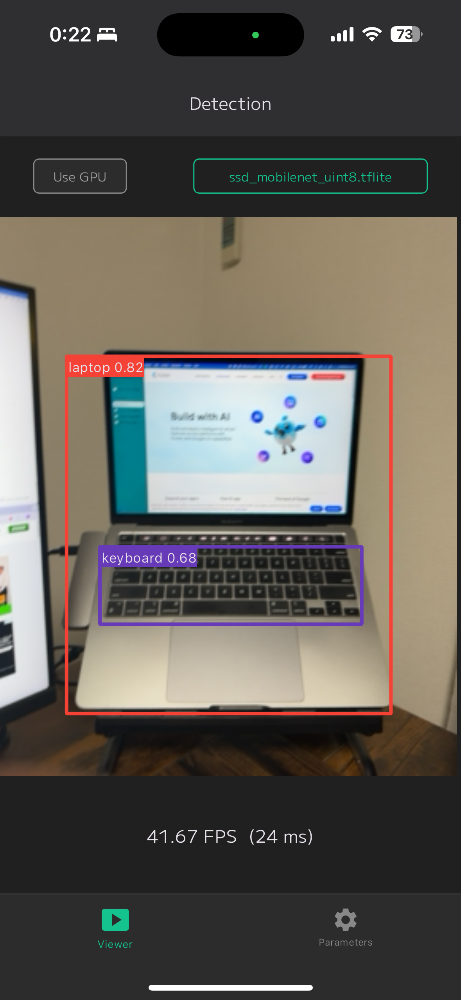
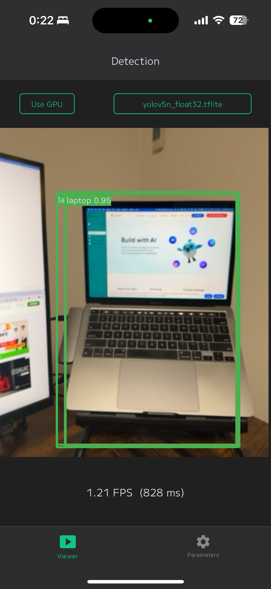
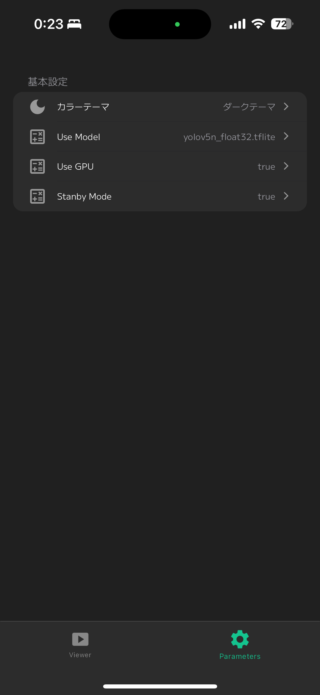

# Flutter Object Detection App

This repository is a Flutter-based object detection app utilizing Yolo v8 and SSD MobileNet models. This project is a fork of [syu-kwsk/flutter_yolov5_app](https://github.com/syu-kwsk/flutter_yolov5_app).

## Screenshots





## Features

- **Yolo v8 Model**: Provides high-precision object detection.
- **SSD MobileNet Model**: Offers fast object detection.
- **GPU Support**: Optimizes performance with GPU support.

## Usage

1. Run the project:
    ```sh
    flutter run
    ```
2. Once the app is running, point your device's camera at objects to detect them.

## Configuration

### Model Selection

You can select the model to use within the app, switching between Yolo v8 and SSD MobileNet.

### GPU Usage

There is an option to enable or disable GPU usage to meet performance requirements.

## Preparing Model Files (.tflite)

Due to the large file size of the model files, they are not included in the repository. Please prepare the required model files (.tflite) yourself.